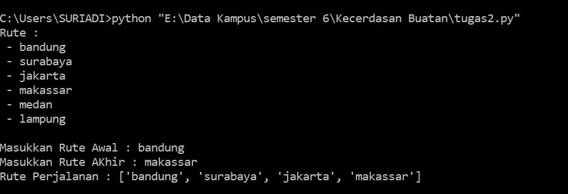

**Representasi Pengetahuan**

  

**Latar Belakang**

Pengetahuan dibedakan menjadi 3 klasifikasi yaitu:

1. Prodecural Knowledge adalah pengetahuan yang berkaitan dengan prosedur atau cara untuk melakukan sesuatu
2. Declarative Knowledge adalah pengetahuan untuk dapat menentukan nilai benar dan salah suatu hal
3. Tacid Knowledge kadang disebut juga sebagai &quot;unconscious knowledge&quot;, karena pengetahuan tidak dapat diekspresikan atau didefinisikan dengan bahasa.

         Representasi Pengetahuan adalah metode yang digunakan untuk mengodekan pengetahuan dalam suatu sistem pakar. Yang dimaksudkan untuk menangkap sifat-sifat penting problema dan membuat informasi itu dapat diakses oleh prosedur pemecahan problema.

1. Jelaskan yang di maksud Representasi Pengetahuan?
2. Jelaskan pengertian Presentasi?
3. Jelaskan pengertian Pengetahuan?
4. Jelaskan  hubungan tahu dengan paham?
5. Jelaskan pengertian Fakta?

Penjelasan

  1. Representasi Pengetahuan adalah metode yang digunakan untuk mengodekan pengetahuan dalam suatu sistem pakar. Yang dimaksudkan untuk menangkap sifat-sifat penting problema dan membuat informasi itu dapat diakses oleh prosedur pemecahan problema.
  2. Presentasi adalah memaparkan atau memberikan informasi, gagasan, emosi, dan sebagainya dengan menggunakan simbol-simbol, kata-kata, gambar, grafis, angka, dll dari seorang pembicara pada audiens dengan maksud tertentu.
  3.  Pengetahuan adalah  [informasi](https://id.wikipedia.org/wiki/Informasi) atau maklumat yang diketahui atau disadari oleh seseorang. Pengetahuan termasuk, tetapi tidak dibatasi pada  [deskripsi](https://id.wikipedia.org/wiki/Deskripsi),  [hipotesis](https://id.wikipedia.org/wiki/Hipotesis),  [konsep](https://id.wikipedia.org/wiki/Konsep),  [teori](https://id.wikipedia.org/wiki/Teori),  [prinsip](https://id.wikipedia.org/w/index.php?title=Hukum_(asas)&amp;action=edit&amp;redlink=1) dan  [prosedur](https://id.wikipedia.org/wiki/Prosedur) yang secara  [Probabilitas Bayesian](https://id.wikipedia.org/w/index.php?title=Probabilitas_Bayesian&amp;action=edit&amp;redlink=1) adalah  [benar](https://id.wikipedia.org/wiki/Benar) atau  [berguna](https://id.wikipedia.org/w/index.php?title=Berguna&amp;action=edit&amp;redlink=1).
  4. Hubungan antara tahu dengan paham, jika kita tahu belum tentu kita paham, sedangkan jika kita paham udah pasti kita tahu. Proses yang mengubah tahu menjadi paham adalah Berfikir, karena dengan berfikir kita dapat menjadi paham apa yang kita tahu.
  5. Fakta merupakan hal, keadaan, atau peristiwa yang merupakan kenyataan atau sesuatu yang benar-benar terjadi. Contoh : Suriadi adalah laki – laki. Jika di bahasa pemrograman contohnya : laki – laki (Suriadi)