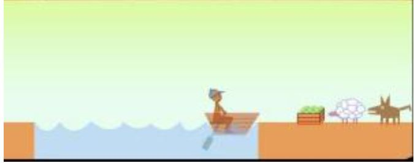
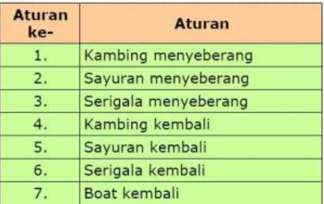
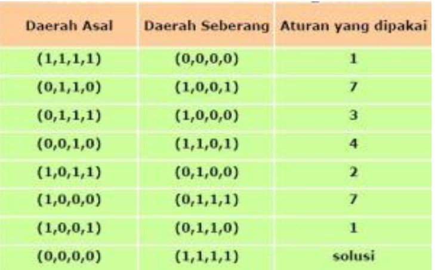

**Ruang Keadaan**

**Latar Belakang Masalah**

1. Jelaskan pengertian  Ruang Keadaan?
2. Sebutkan cara untuk mempresentasikan Ruang Keadaan?
3. Jelaskan yang  dimaksud dari cara – cara presentasi Ruang Keadaan?
4. Berikan Contoh Ruang Keadaan?

Penjelasan

1.  Suatu Ruang Keadaan Ruang Keadaan (State Space), merupakan suatu ruang yang berisi semua keadaan yang mungkin. Kita dapat memulai bermain missionair dan kanibal dengan menetapkan keadaan awal, kemudian bergerak dari satu keadaan ke keadaan yang lain sesuai dengan aturan yang ada, dan mengakhiri permainan jika salah satu telah mencapai tujuan.
2. Cara untuk mempresentasikan ruang keeadaan antara lain:

a. Graf Keadaan
b. Pohon Keadaan
c. Pohon AND/OR

3. Graf Keadaan merupakan node – node yang menunjukkan keadaan yaitu keadaan awal dan keadaan baru yang akan dicapai dengan menggunakan operator . Node – node saling dihubungankan dengan menggunakan arc (busur) yang diberi anak panah untuk menunjukkan arah
4. Petani, Sayur, Kambing dan Serigala
  1. Seorang petani akan menyeberangkan seekor kambing, seekor serigala, dan sayur-sayuran dengan sebuah boat yang melalui sungai.
  2. Boat hanya bisa memuat petani dan satu penumpang yang lain (kambing, serigala atau sayur-sayuran).
  3. Jika ditinggalkan oleh petani tersebut, maka sayur-sayuran akan dimakan oleh kambing, dan kambing akan dimakan oleh serigala.

 

  

   **1.**** Penyelesaian masalah secara umum**

1. Mendefinisikan suatu ruang keadaan;
2. Menetapkan satu atau lebih keadaan awal;
3.  Menetapkan satu atau lebih tujuan;
4. Menetapkan kumpulan aturan.

   **2.**** Penyelesaian**

1.  Identifikasi ruang keadaan
2. Permasalahan ini dapat dilambangkan dengan (JumlahKambing, JumlahSerigala, JumlahSayuran, JumlahBoat).
3. Sebagai contoh: Daerah asal (0,1,1,1) berarti pada daerah asal tidak ada kambing, ada serigala, ada sayuran, dan ada boat.
4. Keadaan Awal
5. Daerah asal: (1,1,1,1)
6. Daerah seberang: (0,0,0,0)
7. Tujuan
8. Daerah asal: (0,0,0,0)
9. Daerah seberang: (1,1,1,1)

   **3.**** Aturan-aturan**

 

  

   **4.**** Penyelesaian**

  
 
Penutup

Kesimpulan

Dari pernyataan diatas dapat diambil kesimpulan bahwa Mendefinisikan suatu ruang keadaan, Menetapkan satu atau lebih keadaan awal (initial state) , Menetapkan satu atau lebih tujuan (goal state),Menetapkan kumpulan aturan

Saran

Dari kesimpulan yang dibuat sebaiknya proses yang ada pada ruang keadaan dapat diimplementasikan untuk mencapai sebuah keadaan baru dengan menggunakan operator yang tersedia

