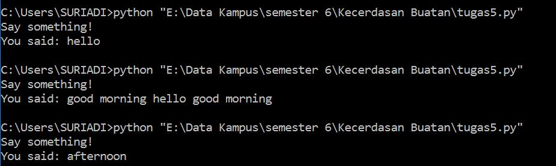

PENGOLAHAN BAHASA ALAM

  

Rumusan Masalah

1. Jelaskan yang di maksud Pengolahan Bahasa Alami
2. Sebutkan dan Jelaskan Bidang Pengetahuan Dalam Natural Language
3. Jelaskan yang di maksud Speech Recognition

Penjelesan

1. Pengolahan bahasa alami atau dalam bahasa inggris natural language processing mengacu pada metode kecerdasan buatan digunakan untuk berkomunikasi dengan komputer menggunakan bahasa keseharian manusia. Sebuah sistem bahasa alami juga harus diperhatikan dari segi kata yang digunakan, arti kata tersebut, kata-kata yang digabung untuk menghasilkan suatu kalimat dan lain sebagainya. Tetapi ada satu hal juga yang harus dipertimbangkan, yaitu kemampuan manusia untuk mengerti bahasa yang digunakan untuk berkomunikasi.

1. 2.Bidang Pengetahuan Dalam Natural Language

1. Fonetik dan fonologi

Fonetik dan fonologi merupakan pengetahuan yang digunakan untuk mendeteksi suara menjadi sebuah kata yang dapat dikenali. Contoh : Siri, Cortana, Google Assitant dan lain sebagainya.

1. Morfologi

Morfologi merupakan pengetahuan tentang pembentukan kata dari kata dasar. Contoh : menyanyi -&gt; me-nyanyi.

1. Sintaksis

Sintaksis merupakan pengetahuan tentang pembentukan urutan kata dalam kalimat atau pembentukan aturan baku sebuah kalimat.

1. Semantik

Semantik mempelajari suatu arti kata dan arti kata tersebut membentuk suatu arti dari kalimat yang utuh.

1. Pragmantik

Pragmatik merupakan pengetahuan yang berorientasi pada tujuan dan situasi pembuatan sistem.

1. Discourse Knowledge

Discourse Knowledge melakukan pengenalan suatu kata yang sudah dibaca sebelumnya akan berpengaruh pada arti kata selanjutnya.

1. World Knowledge

World Knowledge mencakup arti khusus suatu kalimat.

1. 3.Speech Recognition

SpeechRecognition merupakan library python untuk melakukan pengenalan suara, dengan dukungan beberapa mesin dan API, online dan offline. Dibawah ini akan dijelaskan bagaimana cara menginstall dan apa saja yang dibutuhkan sebelum menginstall SpeechRecognition pada sistem operasi Windows. Pertama, install terlebih dahulu pyaudio yang digunakan untuk menginput micropone.

        pip install pyaudio

Selanjutnya install PocketSphinx untuk menggunakan Sphinx recognizer.

        pip install wheel

Lalu install Google API Client Library for Python untuk menggunakan Google Cloud Speech API.

        pip install google-api-python-client

Terakhir install SpeechRecognition.

        pip install SpeechRecognition

Selesai. Dibawah ini juga terdapat contoh hasil program mengubah suara ke teks menggunakan library SpeechRecognition.

   

## Kesimpulan

Pada pembahasan diatas dapat di ambil kesimpulan bahwa  pengolahan bahasa alami mengacu pada metode kecerdasan buatan digunakan untuk berkomunikasi dengan komputer menggunakan bahasa keseharian manusia dan terdapat beberapa bidang yang berhubungan dengan pengolahan bahasa alami. Dan untuk praktikum coba gunakan library python SpeechRecognition untuk melakukan pengenalan suara.

## Saran

## Materi diatas agar lebih didalami dan dipahami

